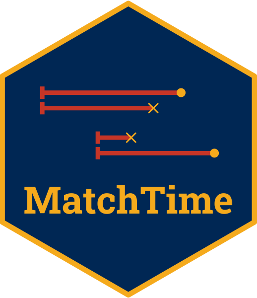

<!-- README.md is generated from README.Rmd. Please edit that file -->

```{r, include = FALSE}
knitr::opts_chunk$set(
  collapse = TRUE,
  comment = "#>",
  fig.path = "man/figures/README-",
  out.width = "100%"
)
```

<!-- badges: start -->
[](https://www.repostatus.org/#wip)
[](https://cran.r-project.org/package=MatchTime)
[](https://cran.r-project.org/package=MatchTime)
[](https://github.com/RobinDenz1/MatchTime/actions/workflows/R-CMD-check.yaml)
[](https://app.codecov.io/gh/RobinDenz1/MatchTime?branch=main)
<!-- badges: end -->

# MatchTime 

`MatchTime` is an R-Package which can be used to perform different sorts of time-dependent matching, which is also known as *sequential trial emulation*. In this type of matching, the treatment, outcome, and confounders are allowed to change over time. At each point in time where individuals switch from "untreated" to "treated", controls which at this point in time are still "untreated" are matched to these individuals using standard matching methods. The point in time that this matching occurred is considered to be the "point of randomization" or "time-zero" for both cases and their matched controls. The result is a dataset that can be analyzed using standard time-to-event methods, such as simple Cox proportional-hazards regression models, even when
complex forms of time-dependent confounding and treatment-confounder feedback are present in the data.
 
The package is designed to be as similar as possible to the excellent `MatchIt` package, and implements direct support for it when matching at each separate point in time. It supports treatment and covariate changes in discrete and continuous time by requiring the user to input *start-stop* data. Because generating and dealing with start-stop data can be difficult, it also implements various functions to make this easier for the user. Large parts of `MatchTime` were originally developed for the purpose of analyzing data from a large German health-insurance provider. As such, the functions are designed to be very fast and RAM efficient, relying almost entirely on the `data.table` package internally. Input datasets with ~ 20 million rows can be used in any function on a regular computer without any issues.

Note that this package is still in early phases of development. Large breaking changes may therefore occur without any warnings.

## Installation

The developmental version may be installed from github using the `remotes` R-Package:

```R
library(remotes)

remotes::install_github("RobinDenz1/MatchTime")
```

## Bug Reports and Feature Requests

If you encounter any bugs or have any specific feature requests, please file an [Issue](https://github.com/RobinDenz1/MatchTime/issues).

## Example

A small example for time-dependent matching on continuous start-stop data is given below, using the `heart` dataset from the `survival` package:

```{r, warning=FALSE, message=FALSE}
library(data.table)
library(MatchTime)
library(MatchIt)
library(survival)

data("heart")

set.seed(1234)

m_obj <- match_time(transplant ~ age + surgery, data=heart, id="id",
                    match_method="nearest")
```

As in `MatchIt`, balance statistics (at "baseline") can be calculated using:

```{r}
summary(m_obj)
```

The actual number of cases and matched controls over time, as well as the number of potential controls at these points in time can additionally be visualized using:

```{r example_plot}
plot(m_obj)
```

In this particular example, after around t = 45, there are no potential controls anymore, because no replacement was used and there are more cases than controls.

## Citation

Use `citation("MatchTime")` to get the relevant citation information.

## License

© 2024 Robin Denz

The contents of this repository are distributed under the GNU General Public License. You can find the full text of this License in this github repository. Alternatively, see <http://www.gnu.org/licenses/>.
